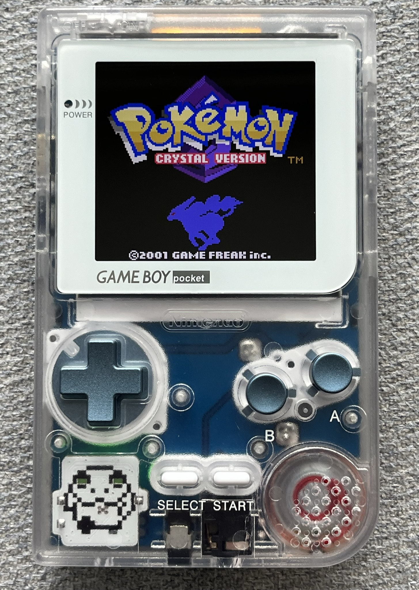
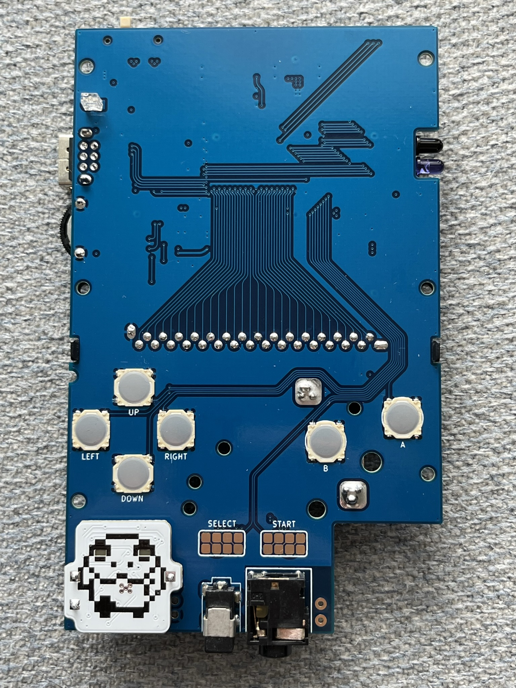
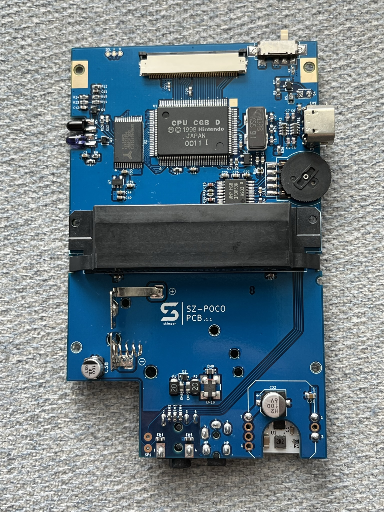

# SZ Pocket Color (SZ-POCO)
Introducing the SZ Pocket Color or SZ-POCO, this PCB transforms a Game Boy Color into the form-factor of a Game Boy Pocket.

# Features

- 4-Layer Board with GND and PWR Planes
- Conveniently-placed solder pads for aftermarket IPS screen kit controls
- IR blasters relocated to where the contrast wheel would normally sit in the Game Boy Pocket 
- Option for tactile buttons on the directional pad, A/B, and start/select buttons (picture below is of an older revision of the PCB)

# Disclaimer
You will need to transfer components from a working Game Boy Color for this PCB to work.  Please do not attempt this project if you are inexperienced in soldering; populating this PCB will require desoldering and micro-soldering surface mount components.  You will also need to be able to read/understand the CGB schematics and be able to self-troubleshoot any issues.  I do not take responsibility or accept blame for any damage to your Game Boy Color or for any failed attempts. 

**Note**: There are multiple revisions of the OEM CGB PCBs (CPU-01 through CPU-06).  CGB-CPU revisions 01-05 have slight differences in passive components,  but they *should* be compatible with this PCB.  **CGB-CPU revision 06 is incompatible and cannot be used with this PCB.**  

I have personally tested this PCB and successfully created a working SZ Pocket Color using components from an OEM **CGB-CPU-04**. All features have been confirmed as working with the unit that I have created. ***However, I cannot guarantee a fully working unit if you undertake this project as there are too many factors that can cause issues, so please acknowledge this disclaimer and order/use this PCB at your own risk. Unless it is a PCB design issue, I will be providing limited technical support for any issues you may have.***

If you have suggestions to improve or identify issues with the PCB design, please contact me on discord: *skimzor#5078*.

# Purchase and Ordering

The SZ Pocket Color PCB will be available for purchase through Ko-fi and Etsy 

- [Ko-fi](https://ko-fi.com/skimzor)
- Etsy

You can also order the boards through PCBWay as a shared project. Link

**Gerbers/source files will not be released.**  

# PCB Bill of Materials & Assembly

As mentioned above in the disclaimer, assembly of this PCB requires advance soldering experience and ability to self-troubleshoot any issues.

Since this PCB uses the original CGB schematics, you are able to directly transplant components from a donor console to create a working SZ Pocket Color.  Components can also be ordered through an electronic components distributor (e.g. digikey, mouser, etc.) and can be found in the Bill of Materials (BOM) unless otherwise noted as required from the donor CGB (e.g. CGB CPU, Crystal, etc.). 

**Note:** Component transfer from a donor Game Boy Color to the SZ-POCO PCB is one to one (e.g. C1 from the donor PCB goes to C1 on SZ-POCO, R3 from the donor PCB goes to R2 on SZ-POCO, etc). Please verify orientation/polarity of components before soldering.

# Additional Parts

In addition to the donor Game Boy Color, you will need the following items to make a functional handheld SZ Pocket Color.  You can find all of these parts on Retro Game Repair Shop.  Use the discount code **"discord"** for 10% off your order.

- **Game Boy Color IPS Kit:** You will need a Game Boy Color IPS Kit with a Q5 LCD and OSD Driver Board (usually named one-chip or HISPEEDIDO).  Any other IPS Kit will not work. [(Link)](https://retrogamerepairshop.com/collections/gbc-displays/products/game-boy-color-q5-ips-backlight-with-osd?variant=37646279213228) 
- **Game Boy Pocket Shell:** It is recommended to get the Funnyplyaing IPS-Ready Game Boy Pocket shell. You can use any Game Boy Pocket shell but be prepared to trim [(Link)](https://retrogamerepairshop.com/collections/gbp-lenses/products/funnyplaying-game-boy-pocket-q5-ips-ready-shell-housing-no-cut)
- **Game Boy Pocket Buttons:** RetroCNC Game Boy Pocket Buttons are my personal recommendation, but if you want plastic buttons it is recommended to get Funnyplaying ones; however, any Game Boy Pocket buttons will work [(Link)](https://retrogamerepairshop.com/collections/gbp-buttons-1/products/game-boy-pocket-metal-buttons-by-retrocnc) / [(Link)](https://retrogamerepairshop.com/collections/gbp-buttons-1/products/funnyplaying-game-boy-custom-pocket-buttons)
- **Game Boy Pocket Membranes:** Again, it is recommended to get Funnyplaying Game Boy Pocket membranes; however, any Game Boy Pocket membranes will work [(Link)](https://retrogamerepairshop.com/collections/gbp-buttons-1/products/funnyplaying-game-boy-pocket-silicone-button-contact-pad-membranes)
- **Game Boy Pocket Lens:** Recommendation is to get a Game Boy Pocket glass lens [(Link)](https://retrogamerepairshop.com/collections/gbp-lenses-1)
- **Game Boy Pocket Battery Terminals:** You will need Game Boy Pocket battery terminals as the Game Boy Color ones will not fit [(Link)](https://retrogamerepairshop.com/products/gbp-game-boy-pocket-high-quality-replacement-battery-contact-terminals?_pos=3&_sid=2c6c2a553&_ss=r&variant=37893131305132 )

# DC Power Board

You are able to use the OEM Game Boy Color DC/DC Regulator Board with the SZ Pocket Color; however, there are more modern options suggested below:

- skimzor's SZ-REG
- [marshallh's GBPP](https://github.com/marshallh/gbpp)
- [leggomyfroggo's frogulator](https://www.etsy.com/shop/FroggoCustoms?ref=nla_listing_details)

# License

 
 
This project/PCB is licensed under a Creative Commons Attribution-NonCommercial-ShareAlike 4.0 International License. ***Under this license, you are not permitted to profit from or commercialize this project.***
